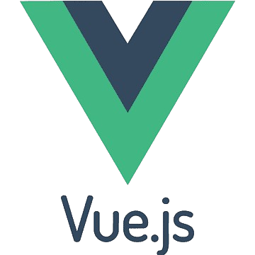

# The Recipes App - Vue

  
  

## Dev

1. Instalar dependencias `npm install`.

2. Copiar el archivo `.env.template` y renombrarlo a `.env` y configurar las variables.

3. Correr el proyecto en modo desarrollo `npm run dev`.
